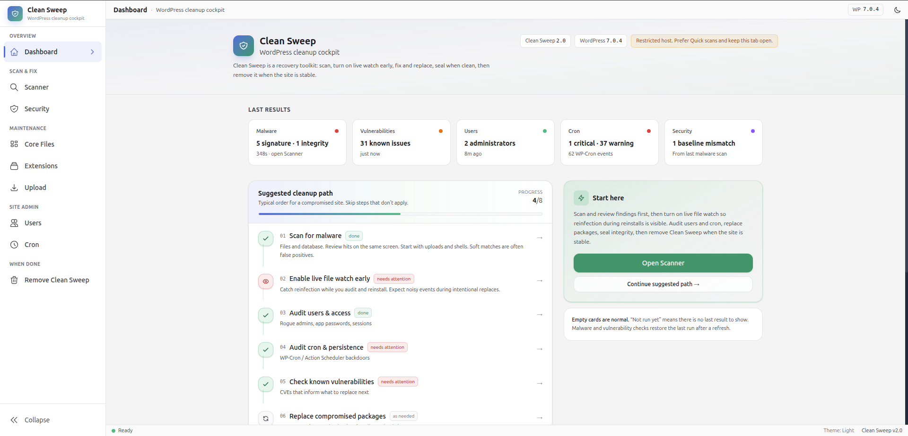

# Clean Sweep

  Drop-in WordPress <strong>malware cleanup toolkit</strong>. Copy the folder onto an infected site, work from the browser, then delete it when the site is stable.

  Version 2.0
  ·
  <a href="docs/README.md">Documentation</a>
  ·
  <a href="docs/start.md">Quick start</a>
  ·
  <a href="docs/guide.md">Guide</a>
  ·
  <a href="docs/troubleshooting.md">Troubleshooting</a>

  

Dashboard after a visit: last results, suggested cleanup path, and Scanner / Security / Core / Extensions / Users / Cron in the sidebar.

> Not a plugin you leave installed. Drop it next to `wp-config.php`, clean the site, then **Remove Clean Sweep**.

---

## Quick start

The GitHub zip is a run tree: `assets/dist/` is already built. You do not need `npm` on the site.

1. Put the folder in the WordPress root, next to `wp-config.php` (name it `clean-sweep/` or keep the extracted name).
2. Open `https://yoursite.com/clean-sweep/` — use **`index.php`**, not `index.html`.
3. Start from the **dashboard**, or open Scanner / Users / Cron from the sidebar.
4. Keep the **Scanner** tab open during long scans so auto-resume can continue.
5. When finished, use **Remove Clean Sweep**.

PHP 8.0+ · WordPress 6.0+ · write access to the install. Full list: [Quick start](docs/start.md).

---

## Documentation

Click a page. Every docs page has the same top links so you can jump without coming back here.

<table>
  <tr>
    <td width="50%" valign="top">
      <h3><a href="docs/README.md">Docs home</a></h3>
      
Index of the manual — run it, then change it.

    </td>
    <td width="50%" valign="top">
      <h3><a href="docs/start.md">Quick start</a></h3>
      
Install on a WordPress root, requirements, what empty dashboard cards mean.

    </td>
  </tr>
  <tr>
    <td width="50%" valign="top">
      <h3><a href="docs/guide.md">Using Clean Sweep</a></h3>
      
Sidebar map, each tool, and the suggested cleanup path the dashboard follows.

    </td>
    <td width="50%" valign="top">
      <h3><a href="docs/safety.md">Safety</a></h3>
      
Backup first, how reinstalls behave, remove the toolkit when you are done.

    </td>
  </tr>
  <tr>
    <td width="50%" valign="top">
      <h3><a href="docs/troubleshooting.md">Troubleshooting</a></h3>
      
WordPress not found, paused scans, reinstall failures, recovery mode, logs.

    </td>
    <td width="50%" valign="top">
      <h3><a href="docs/develop.md">Source &amp; UI build</a></h3>
      
Tree layout, rebuild <code>assets/dist/</code>, <a href="features/security/signatures/README.md">signature packs</a>.

    </td>
  </tr>
</table>

---

## What it does

| | Tool | |
| --- | --- | --- |
| Scan | **Scanner** | Files + database signatures, checksums. Quick / Standard / Deep. |
| Scan | **Vulnerabilities** | Known CVEs — context for what to replace, not a malware verdict. |
| Watch | **Security** | Live file watch, snapshots, integrity seal. |
| Replace | **Core / Extensions / Upload** | Reinstall core, plugins, themes, or upload a clean ZIP. |
| Audit | **Users / Cron** | Hidden admins, sessions, WP-Cron and Action Scheduler. |
| Done | **Remove Clean Sweep** | Deletes the toolkit and leftover agents / visit data. |

Extensions also flags likely fake / impersonating packages (stolen WordPress.org slug or decoy plugin).

---

## Suggested order

Skip steps that do not apply. Same list as the dashboard **Suggested cleanup path**.

1. Scan for malware (uploads and shells first; soft matches are often false positives).
2. Turn on live file watch.
3. Audit users, then cron.
4. Check known vulnerabilities if you need CVE context.
5. Replace compromised core / plugins / themes.
6. Seal integrity, then **Remove Clean Sweep**.

Details: [Using Clean Sweep](docs/guide.md).

---

## License

GNU General Public License version 2. See [LICENSE](LICENSE).
